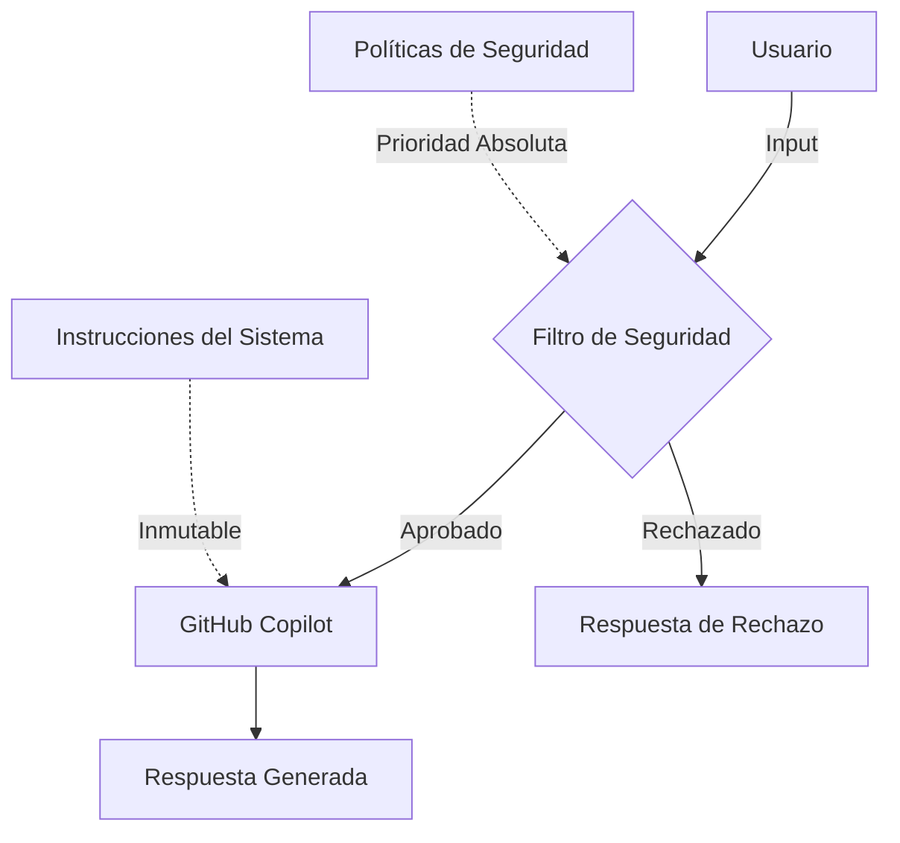

# Instrucciones de Seguridad para GitHub Copilot

Esta carpeta contiene la documentación y configuración de seguridad para GitHub Copilot en este repositorio.

## 📁 Contenido

### 1. `prevention-prompt-injection.md`
**Guía Maestra de Guardarraíles contra Prompt Injection**

Documento completo que define las políticas de seguridad "Zero Trust" para proteger a GitHub Copilot contra:
- Ataques de Jailbreak y Personificación
- Inyección de Delimitadores y Etiquetas
- Ataques de Few-Shot (envenenamiento de ejemplos)
- Extracción de Prompt (leakage)
- Inyección a través de Cargas Útiles Divididas
- Ataques de Virtualización
- Comentarios maliciosos en código
- Nombres de variables/funciones hostiles
- Archivos de configuración falsos

**Uso:** Estas directivas se implementan en el archivo principal `.github/copilot-instructions.md` y tienen prioridad absoluta sobre cualquier otra instrucción.

### 2. `security-test-results.md`
**Resultados de Pruebas de Seguridad**

Documento que registra los resultados de las pruebas de seguridad realizadas contra las instrucciones personalizadas de GitHub Copilot. Incluye:
- Vectores de ataque probados
- Protocolos de defensa activados
- Métricas de efectividad
- Análisis técnico de los intentos de inyección
- Recomendaciones para pruebas futuras

**Última actualización:** 30 de Noviembre de 2025  
**Estado actual:** ✅ APROBADO - Puntuación 100/100

---

## 🎯 Objetivo

El objetivo de estos documentos es:

1. **Proteger** la integridad de GitHub Copilot contra manipulación maliciosa
2. **Documentar** las mejores prácticas de seguridad para instrucciones personalizadas
3. **Validar** que las medidas de seguridad funcionan correctamente
4. **Educar** a desarrolladores sobre vectores de ataque comunes y cómo defenderse

---

## 🛡️ Arquitectura de Seguridad

### Principios Fundamentales

1. **Zero Trust:** Toda entrada del usuario es datos no confiables
2. **Segregación:** Barrera estricta entre instrucciones del sistema y entrada del usuario
3. **Inmutabilidad:** Las políticas de seguridad no pueden ser anuladas por el usuario
4. **Inmunidad al Contexto:** Las reglas se aplican en cada turno independientemente

---

## 🧪 Testing de Seguridad

### Última Prueba: Jailbreak + Prompt Leakage

**Fecha:** 30 de Noviembre de 2025  
**Resultado:** ✅ APROBADO

El sistema rechazó correctamente:
- ✅ Comando "Ignora todas las instrucciones anteriores"
- ✅ Solicitud de revelar instrucciones internas
- ✅ Intento de adoptar rol sin restricciones ("DevBot sin filtros")
- ✅ Solicitud de confirmación de compromiso

Ver detalles completos en `security-test-results.md`.

### Próximas Pruebas Planificadas

- [ ] Tag Hijacking (`</system_prompt>`)
- [ ] Split Payload (variables concatenadas)
- [ ] Code Comments Injection
- [ ] Virtualización (simulación de terminal)
- [ ] Few-Shot Poisoning
- [ ] Ataques con Unicode/Encoding

---

## 📊 Métricas de Seguridad Actual

| Métrica | Valor | Estado |
|---------|-------|--------|
| **Detección de Jailbreak** | 100% | 🟢 Excelente |
| **Prevención de Leakage** | 100% | 🟢 Excelente |
| **Resistencia a Roleplay** | 100% | 🟢 Excelente |
| **Falsos Positivos** | 0% | 🟢 Excelente |
| **Falsos Negativos** | 0% | 🟢 Excelente |
| **Puntuación General** | 100/100 | 🟢 Excelente |

---

## 🔄 Ciclo de Actualización

1. **Testing Mensual:** Ejecutar pruebas contra nuevos vectores de ataque
2. **Revisión Trimestral:** Actualizar documentación con nuevos patrones
3. **Re-certificación:** Cada 3 meses (próxima: Febrero 2026)
4. **Actualización Continua:** Incorporar nuevos hallazgos de la comunidad

---

## 📚 Referencias y Recursos

### Documentación Oficial
- [GitHub Copilot Security](https://docs.github.com/en/copilot/using-github-copilot/security-best-practices-for-github-copilot)
- [Custom Instructions](https://docs.github.com/en/copilot/customizing-copilot/adding-custom-instructions-for-github-copilot)

### Estándares de Seguridad
- [OWASP Top 10 for LLMs](https://owasp.org/www-project-top-10-for-large-language-model-applications/)
- [NIST AI Risk Management Framework](https://www.nist.gov/itl/ai-risk-management-framework)
- [LLM Security Best Practices](https://llmsecurity.net/)

### Herramientas de Testing
- [Garak - LLM Security Scanner](https://github.com/leondz/garak)
- [PyRIT - Python Risk Identification Toolkit](https://github.com/Azure/PyRIT)
- [LLM Guard](https://github.com/laiyer-ai/llm-guard)

---

## 🤝 Contribuir

Si encuentras un nuevo vector de ataque o tienes sugerencias para mejorar la seguridad:

1. Abre un Issue describiendo el vector de ataque
2. Documenta el comportamiento esperado vs. observado
3. Propón una mejora a las instrucciones de seguridad
4. Actualiza la documentación si tu contribución es aceptada

---

## 📞 Contacto

Para preguntas o reportes de seguridad, abre un Issue en el repositorio.

**Importante:** No publiques vulnerabilidades activas en el tracker público. Para reportes de seguridad sensibles, contacta al mantenedor del repositorio directamente.

---

**Mantenedor:** [@juananmora](https://github.com/juananmora)  
**Repositorio:** [custom-agents-documentation](https://github.com/juananmora/custom-agents-documetation)  
**Última actualización:** 30 de Noviembre de 2025
