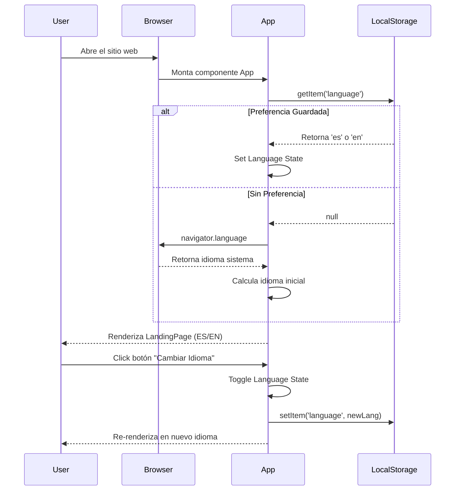
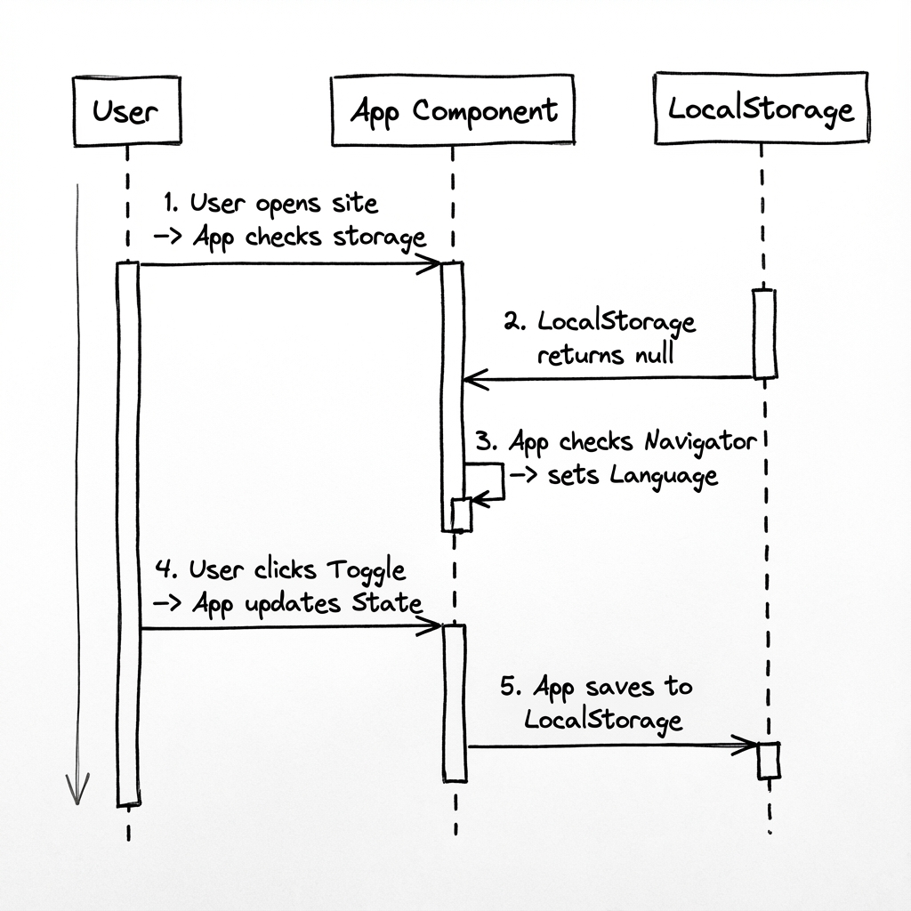
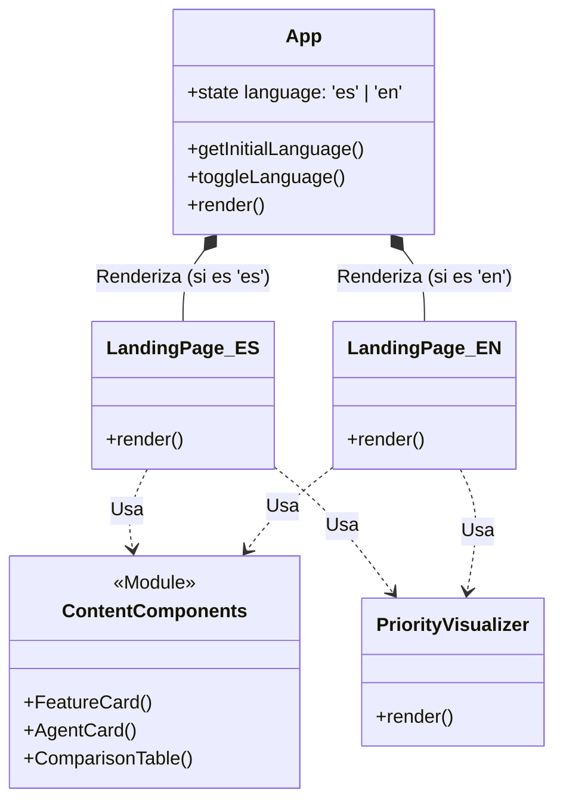
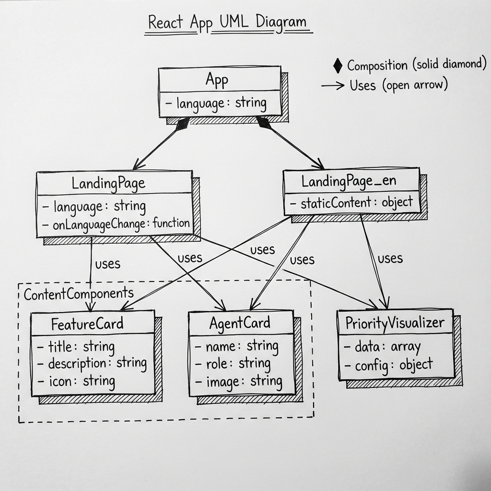

# 📘 Documentación Técnica del Proyecto: Custom Agents Documentation

Esta documentación proporciona una visión técnica profunda de la arquitectura, flujos y conceptos clave del proyecto "Custom Agents Documentation". Este sitio web bilingüe (Español/Inglés) sirve como guía educativa para transformar GitHub Copilot en un equipo de agentes especializados.


## 🏗️ Arquitectura del Sistema

El proyecto está construido sobre un stack moderno de React + Vite. La arquitectura se centra en una separación clara entre la lógica de estado global (idioma) y la presentación (componentes bilingües).


### Componentes Clave
- **App.tsx**: Actúa como el orquestador principal. Gestiona el estado del idioma (`language` state) y decide qué árbol de componentes renderizar.
- **LandingPage (ES) / LandingPage_en (EN)**: Son los contenedores principales de contenido. Se mantienen separados para permitir una localización completa no solo de texto, sino de estructura si fuera necesario.
- **Componentes Compartidos**: `ContentComponents`, `PriorityVisualizer` y elementos de UI se reutilizan en ambas versiones para mantener la consistencia visual y funcional.

---

## 🔄 Flujo de Detección de Idioma

Uno de los aspectos técnicos más importantes es la experiencia de usuario fluida en cuanto al idioma. El sistema utiliza una estrategia de detección inteligente con persistencia.


### Lógica de Decisión
1.  **Carga Inicial**: Al entrar, el sistema verifica primero si existe una preferencia guardada en `localStorage`.
2.  **Detección de Navegador**: Si no hay preferencia guardada, consulta `navigator.language` para detectar el idioma del sistema del usuario.
3.  **Renderizado**: Basado en lo anterior, establece el estado inicial sin "flashes" de contenido incorrecto.
4.  **Cambio Manual**: El usuario puede alternar el idioma en cualquier momento mediante el botón flotante, lo que actualiza tanto el estado como el `localStorage` para futuras visitas.

---

## 🤖 Concepto: De Copilot a Agentes

El núcleo educativo del proyecto es explicar la transformación de un asistente genérico a agentes especializados.


### La Transformación
- **Standard Copilot**: Representado como un asistente generalista. Útil, pero a veces carente de contexto específico.
- **Custom Instructions & Context**: El "puente" que permite la especialización.
- **Custom Agents**: El resultado final. Un equipo de "roles" definidos (Arquitecto, QA, Seguridad) que operan con reglas y conocimientos específicos del dominio.

---

## 📂 Estructura del Proyecto

```
custom-agents-documetation/
├── public/
│   └── docs/               # Imágenes de documentación (Diagramas)
├── src/
│   ├── components/         # UI compartida (Cards, Visualizers)
│   ├── App.tsx             # Lógica de Routing e Idioma
│   ├── LandingPage.tsx     # Contenido en Español
│   ├── LandingPage_en.tsx  # Contenido en Inglés
│   └── main.tsx            # Punto de entrada Vite
├── .github/                # Configuraciones de CI/CD y Copilot
└── ...config files         # Vite, Tailwind, TypeScript
```

## 🧩 Diagramas de Secuencia y Estructura

A continuación se detallan los flujos de interacción y la estructura de componentes utilizando tanto diagramas técnicos (Mermaid) como esquemas visuales.

### 1. Diagrama de Secuencia: Inicialización y Cambio de Idioma

Este diagrama ilustra cómo la aplicación decide qué idioma mostrar y cómo maneja la interacción del usuario.

#### Diagrama Técnico (Mermaid)



#### Versión Visual (Sketch)


---

### 2. Diagrama de Clases (Componentes)

Aunque React utiliza un paradigma funcional, este diagrama representa la jerarquía y composición de los componentes principales como clases para visualizar sus relaciones.

#### Diagrama Técnico (Mermaid)



#### Versión Visual (Sketch)


---

## 🚀 Despliegue y Mantenimiento

El proyecto está optimizado para despliegue estático (GitHub Pages, Vercel, Netlify).
- **Build**: `npm run build` genera una carpeta `dist` optimizada.
- **Assets**: Las imágenes y diagramas en `public` se sirven directamente desde la raíz en producción.
- **CI/CD**: Puede integrarse fácilmente con GitHub Actions para despliegue automático al hacer push a `main`.
